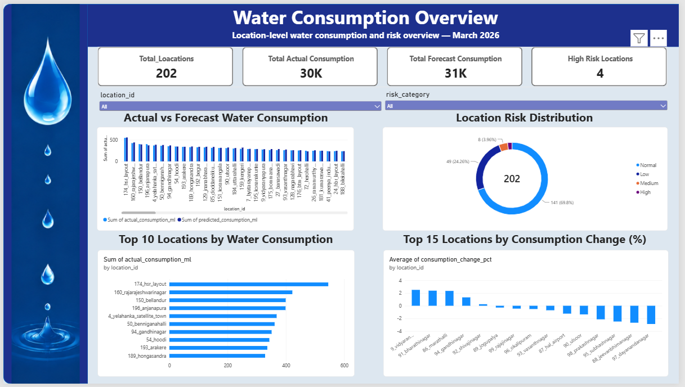

<<<<<<< HEAD
# Bengaluru Water Loss Intelligence

## Project Overview

**Bengaluru Water Loss Intelligence** is a data analytics and machine learning project focused on analyzing historical water consumption across Bengaluru locations, forecasting water consumption, and identifying locations that may require operational attention based on consumption risk indicators.

The project combines data cleaning, feature engineering, machine learning, forecast analysis, risk analysis, visualizations, and an interactive Power BI dashboard.

---

## Project Objectives

The main objectives of this project are to:

- Clean and prepare historical water consumption data.
- Engineer features that capture consumption patterns and changes.
- Train and compare machine learning models for water consumption prediction.
- Generate water consumption forecasts for locations.
- Compare actual and predicted consumption.
- Analyze prediction errors.
- Identify high-, medium-, and low-risk locations.
- Provide location-level insights through an interactive Power BI dashboard.

---

## Project Workflow

```text
Raw Water Consumption Data
        ↓
Data Cleaning
        ↓
Processed Dataset
        ↓
Feature Engineering
        ↓
Model Training and Comparison
        ↓
Water Consumption Forecasting
        ↓
Prediction Error Analysis
        ↓
Consumption Risk Analysis
        ↓
Visualizations
        ↓
Power BI Dashboard
```

---

## Dataset

The project uses a historical water consumption dataset containing location-level water consumption information.

### Data Stages

- **Raw data**: Original water consumption dataset.
- **Processed data**: Cleaned dataset used for further analysis and modeling.
- **Final data**: Forecast and prediction results generated by the machine learning workflow.

---

## Machine Learning

The project includes the following machine learning models:

- Random Forest
- Gradient Boosting

The trained models and model comparison results are stored in the `models/` directory.

The final forecasting output contains location-level actual and predicted water consumption values along with prediction error information.

---

## Risk Analysis

The project performs location-level risk analysis using consumption-related indicators, including:

- Consumption deviation
- Consumption change percentage
- Rolling 3-month consumption variability
- Prediction error percentage
- Risk score
- Risk category

Locations are categorized into risk groups such as:

- High Risk
- Medium Risk
- Low Risk

This analysis helps identify locations that may require additional attention.

---

## Analysis Outputs

The `Analysis/` directory contains:

### `analysis_summary.csv`

Contains summary-level analysis results.

### `location_error_analysis.csv`

Contains location-level prediction error analysis.

### `prediction_error_analysis.csv`

Contains detailed prediction error information.

### `risk_analysis.csv`

Contains risk scores, risk categories, and consumption-related risk indicators.

---

## Visualizations

The project includes the following visualizations:

- Actual vs Predicted Water Consumption
- Consumption Risk
- Prediction Error Distribution
- Top Error Locations
- Feature Importance

These visualizations are stored in the `visualization/` directory.

---

## Power BI Dashboard

The Power BI dashboard provides an interactive view of the water consumption analysis.

### Page 1 — Water Consumption Overview

This page provides a high-level overview of water consumption across locations.

It includes:

- Total Locations
- Total Actual Consumption
- Total Forecast Consumption
- High Risk Locations
- Actual vs Forecast Water Consumption
- Location Risk Distribution
- Top Locations by Water Consumption
- Top Locations by Consumption Change

Filters include:

- Location
- Risk Category

---

### Page 2 — Consumption Risk Analysis

This page focuses on identifying locations that require attention.

It includes:

- High Risk Locations
- Medium Risk Locations
- Low Risk Locations
- Locations with Unusual Consumption
- Risk Level by Location
- Locations Requiring Attention
- Consumption Deviation
- Consumption Variability

Filters include:

- Location
- Risk Category

---

### Page 3 — Location Details

This page allows users to investigate an individual location.

It includes:

- Location Selector
- Actual Consumption
- Predicted Consumption
- Deviation Percentage
- Risk Category
- Actual vs Predicted Consumption
- Historical Water Consumption
- Monthly Consumption Change
- Location Risk Indicators

The location risk indicators include:

- Deviation Percentage
- Consumption Change Percentage
- Rolling 3-Month Standard Deviation
- Prediction Error Percentage

---

## Project Structure

```text
Bengaluru_water_loss_Intelligence/
│
├── Analysis/
│   ├── analysis_summary.csv
│   ├── location_error_analysis.csv
│   ├── prediction_error_analysis.csv
│   └── risk_analysis.csv
│
├── Dashboards/
│   └── Water_Consumption_Dashboard.pbix
│
├── data/
│   ├── raw/
│   │   └── Water_Consumption_Data_for_year.csv
│   │
│   ├── processed/
│   │   └── bengaluru_water_consumption_cleaned.csv
│   │
│   └── final/
│       └── water_consumption_forecast_predictions.csv
│
├── models/
│   ├── gradient_boosting_model.pkl
│   ├── model_comparison.csv
│   └── random_forest_model.pkl
│
├── notebooks/
│   ├── Data_Cleaning.ipynb
│   ├── Feature_Engineering.ipynb
│   └── Final_Analysis_and_Dashboard_Preparation.ipynb
│
├── visualization/
│   ├── actual_vs_predicted.png
│   ├── consumption_risk.png
│   ├── feature_importance.png
│   ├── prediction_error_distribution.png
│   └── top_error_locations.png
│
└── README.md
```

---

## Technologies Used

- Python
- Pandas
- NumPy
- Scikit-learn
- Matplotlib
- Jupyter Notebook
- Power BI

---

## Key Use Cases

This project can support operational analysis by helping users:

- Understand water consumption across locations.
- Compare actual and forecast consumption.
- Identify locations with significant consumption changes.
- Identify locations with higher consumption risk.
- Investigate individual location-level consumption patterns.
- Support data-driven monitoring and decision-making.

---

## How to Use the Project

1. Review the raw dataset in `data/raw/`.
2. Run the data cleaning notebook.
3. Run the feature engineering and modeling notebook.
4. Review the final forecast dataset in `data/final/`.
5. Review the analysis files in `Analysis/`.
6. Review the generated charts in `visualization/`.
7. Open `Water_Consumption_Dashboard.pbix` in Power BI Desktop.

---

## Project Status

**Completed**

The project includes the complete workflow from raw data processing through machine learning forecasting, risk analysis, visualization, and dashboard development.
=======
# Projects
>>>>>>> 4b2987040c235ff1ba549ec08b4bc872ca9d1568
